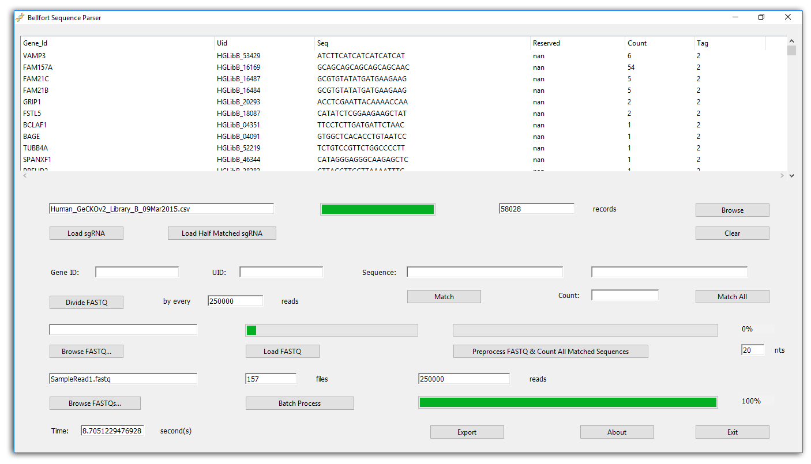

# Bellfort Sequence Parser
A dialog-based GUI application of gene read-alignment parsing and analysis.

**Chuan Yang**, M.D.
<br>Visiting Research Associate
<br>Chen Lab
<br>Human Genome Sequencing Center
<br>Department of Molecular and Human Genetics
<br>Baylor College of Medicine

[](https://github.com/YangChuan80/BellfortSequenceParser/blob/master/README.md)
[](LICENSE)
[](https://github.com/YangChuan80/BellfortSequenceParser/blob/master/README.md)
[](https://github.com/YangChuan80/BellfortSequenceParser/blob/master/BellfortSequenceParser_Installer.exe?raw=true)
[](README.md)
[](https://github.com/YangChuan80)

## Introduction
**Read Alignment Problem:** 
The advancement of sequencing technologies has made it feasible for researchers to consider many high-throughput biological applications. A core step of these applications is to align an enormous amount of short DNA sequences to other enormous amounts of reads in FASTQ files. A first generation of hash table-based methods has been developed, including MAQ, which is accurate, feature rich and fast enough to align short reads from a single individual. Python dictionaries are implemented using hash tables. It is an array whose indexes are obtained using a hash function on the keys. The goal of a hash function is to distribute the keys evenly in the array. A good hash function minimizes the number of collisions e.g. different keys having the same hash.  

**Bellfort Sequence Parser** is a dialog-based GUI application solving the read alignment problems and corresponding I/O implementations. It has a friendly user-interface to perform FASTQ/sequence file browsing, loading and preprocessing. The algorithm of FASTQ read preprocess uses k-mer index by which the specific gene sequence search can be speedy and easy with a high performance and low system resource consumption. The term k-mer typically refers to all the possible substrings of length k that are contained in a string. In computational genomics, k-mers refer to all the possible subsequences (of length k) from a read obtained through DNA Sequencing. After building a k-mer dictionary (hash table), every key (single gene sequence) of this dictionary can map the specific read(s) immediately when the searching is performed. When the perfect match (exact match) made, app can count the match number for each gene sequence, and list them in the spreadsheet table. Furthermore, this spreadsheet of sequence matching counts can easily be exported to a csv file.



## Installation from Binaries
- Download **[BellfortSequenceParser_Installer.exe](https://github.com/YangChuan80/BellfortSequenceParser/blob/master/BellfortSequenceParser_Installer.exe?raw=true)** file from **[here](https://github.com/YangChuan80/BellfortSequenceParser/blob/master/BellfortSequenceParser_Installer.exe?raw=true)**, which is a NSIS installation file only used in Windows platform. 
- After downloading, you can install it directly. When finished, a folder with the same name have been made. Enter the folder BellfortSequenceParser, run the **BellfortSequenceParser.EXE** to go!

## Installation from Source
This option is only recommended for Pythoneer. There are several dependencies necessarily preinstalled in your Python interpreter:

- **Numpy**

```
 pip install numpy
```

- **Pandas**

```
 pip install pandas
```

- **Tkinter**
 - Tkinter is a standard library which has been preinstalled in Python 2.7 or higher issues.

After you complete the BellfortSequenceParser.py file download, run it:

```
python BellfortSequenceParser.py
```

Python interpreter have to be Python 3.4 or higher.
## Instructions
- Click **Load sgRNA** button to choose the sequence file.  
- Load half-matched sequence file by pressing **Load Half Matched sgRNA** button. When file successfully loaded, you can continue to count matched sequences from the last stop point you completed. Don't forget load FASTQ file.
- A record number displayed on the right to show how many sequences are there in your loaded file. You can browse the list of these sequences by clicking **Browse** button, but please be patient to wait for the list loading session which will take up to 30 seconds. Please do not take any other action, which would result in a crash of your operating system.
- Click **Browse FASTQ...** button to choose the FASTQ file. 
- Load this chosen file by pressing **Load FASTQ** button. When file successfully loaded, a information dialog will also pop up. 
- A read number displayed on the bottom to show how many reads this FASTQ file has.
- Please check the number of reads first. If the memory of your PC is less or equals to 8M AND the number of your current loaded FASTQ file is more than 1,000,000 lines of reads. We highly recommend you divide your FASTQ file by every 500,000 lines of reads by clicking **Divide FASTQ** to prevent overflow of your computer's memory.
- If you have performed the FASTQ file division, you have to reload your divided FASTQ files again by pressing **Browse FASTQ...** and **Load FASTQ** buttons.
- Do the preprcessing of FASTQ file and count the matched sequences. It's a two-step action. Preprocess of FASTQ is very important for your read-alignment operation. It will take several minutes to achieve. Please be patient during this period. After preprocess successfully completed, do the counts of all matched sequences with the reads will automatically begins. This course of event will be very fast, and it will cost you less than 1 second! Of course, you can browse your result in the table again. After clicking **Preprocess FASTQ & Count Matched Sequences** button, you can drink a cup of coffee and relex a little bit from your computer work. 
- A text box assigned with 20 by default is on the right of the **Preprocess FASTQ & Count Matched Sequences** button. It means currently the app build a 20-mer dictionary (k = 20) conforming your sequence lenght. You can also specify the k number instead of 20 to customize your sequence matching. - 
- Use **Export** to output a csv file of your count results. Your count report is ready! Congratulations!

## License

**BSD 3-clause "New" or "Revised" License**

Copyright (c) 2016, Chuan Yang

All rights reserved.

Redistribution and use in source and binary forms, with or without
modification, are permitted provided that the following conditions are met:

* Redistributions of source code must retain the above copyright notice, this
  list of conditions and the following disclaimer.

* Redistributions in binary form must reproduce the above copyright notice,
  this list of conditions and the following disclaimer in the documentation
  and/or other materials provided with the distribution.

* Neither the name of BellfortSequenceParser nor the names of its
  contributors may be used to endorse or promote products derived from
  this software without specific prior written permission.

THIS SOFTWARE IS PROVIDED BY THE COPYRIGHT HOLDERS AND CONTRIBUTORS "AS IS"
AND ANY EXPRESS OR IMPLIED WARRANTIES, INCLUDING, BUT NOT LIMITED TO, THE
IMPLIED WARRANTIES OF MERCHANTABILITY AND FITNESS FOR A PARTICULAR PURPOSE ARE
DISCLAIMED. IN NO EVENT SHALL THE COPYRIGHT HOLDER OR CONTRIBUTORS BE LIABLE
FOR ANY DIRECT, INDIRECT, INCIDENTAL, SPECIAL, EXEMPLARY, OR CONSEQUENTIAL
DAMAGES (INCLUDING, BUT NOT LIMITED TO, PROCUREMENT OF SUBSTITUTE GOODS OR
SERVICES; LOSS OF USE, DATA, OR PROFITS; OR BUSINESS INTERRUPTION) HOWEVER
CAUSED AND ON ANY THEORY OF LIABILITY, WHETHER IN CONTRACT, STRICT LIABILITY,
OR TORT (INCLUDING NEGLIGENCE OR OTHERWISE) ARISING IN ANY WAY OUT OF THE USE
OF THIS SOFTWARE, EVEN IF ADVISED OF THE POSSIBILITY OF SUCH DAMAGE.
